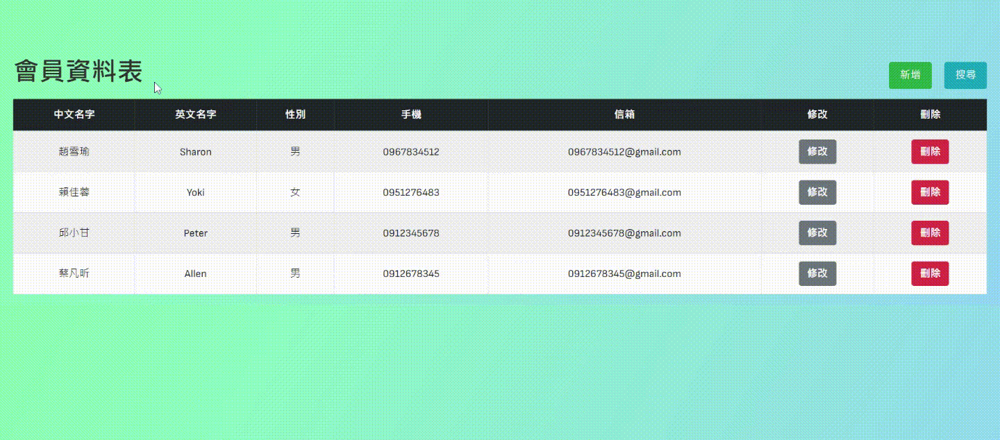
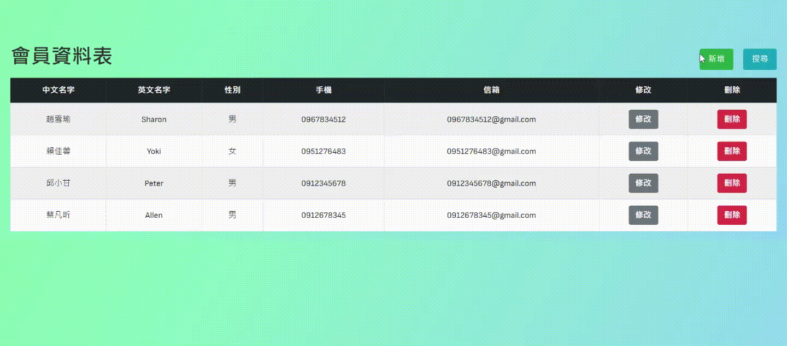
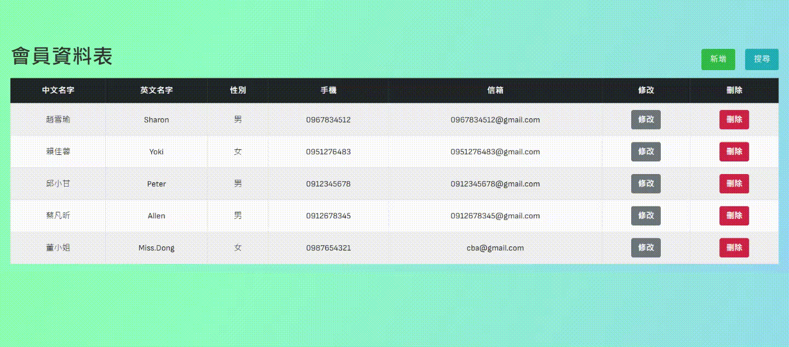

# 會員資料表

Demo: https://justine92415.github.io/interVIewExam/

---

功能預覽

-   滑鼠移動至欄位時以該欄位為中心十字線上的欄列變色
-   滑鼠移到人名時會出現說明文字
-   滑鼠點擊手機時會出現手機資訊
    

## 新增會員 (只能新增表上不存在的中/英文姓名)

-   表單以及格式驗證
    

## 搜尋會員 (表單為空白時預設為搜尋所有會員，可自行選擇搜尋條件)

-   表單以及格式驗證
    

## 編輯會員

-   表單以及格式驗證
-   重新填寫
    

## 刪除會員

-   表單以及格式驗證
-   刪除提醒
    

---

## 前端技術

jQuery

Bootstrap

AJAX

-   以 fetch 的方式發送請求給後端，實現會員資料的增刪改查動作。

## 後端技術

Node.js (Express)

-   以 Restful 風格撰寫 API，並將此 api 布署至 fly.io
-   `GET` /api/members 獲取所有會員資料/搜尋某會員資料
-   `POST` /api/members 新增會員資料
-   `GET` /api/members/:id 獲取會員資料
-   `PATCH` /api/members/:id 更新會員資料
-   `DELETE` /api/members/:id 刪除會員資料

mongoDB (Mongoose)

-   根據前端發送過來的請求，對資料庫做增刪改查的動作
